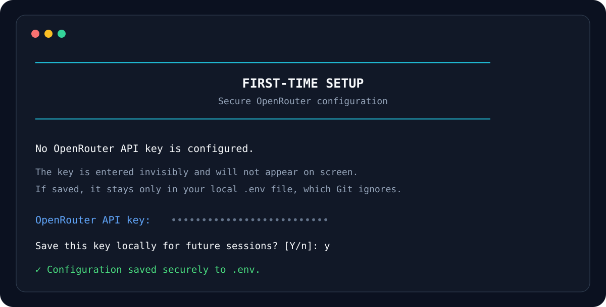

<div align="center">

# AI Coding Agent

**A lightweight autonomous coding agent that can inspect, modify, execute, and verify Python projects.**


</div>

## Interface

The terminal UI uses adaptive-width horizontal rules instead of fragile box corners, so the layout remains aligned across terminals and font configurations.


## First-run setup

No manual `.env` editing is required for a new user. If the OpenRouter key is missing, the application launches a secure setup wizard automatically.



The API key is entered with hidden terminal input. The user can either save it locally to the Git-ignored `.env` file or use it for only the current session.

To update the key later, use either:

```bash
uv run main.py --configure
```

or, from inside the interactive agent:

```text
/configure
```

## Overview

AI Coding Agent is a Python command-line development agent built around an iterative **LLM → tool → result → LLM** feedback loop.

Instead of producing a single answer and stopping, the agent can inspect a codebase, read files, execute Python programs, write changes, observe results, and continue working until it has enough information to return a final response.

The project began during the Boot.dev AI Agent curriculum and has been extended into a cleaner standalone application with guided setup, a persistent interactive shell, safety limits, and expanded documentation.

## Key features

| Feature | Description |
|---|---|
| Autonomous agent loop | Continues reasoning and using tools until the task is complete |
| Guided first-run setup | Prompts securely for an OpenRouter API key when configuration is missing |
| Hidden credential entry | Prevents the API key from being echoed to the terminal |
| In-app reconfiguration | `/configure` updates the API key without leaving the agent |
| Adaptive terminal UI | Uses terminal-aware widths and straight horizontal rules for consistent alignment |
| File inspection | Lists project directories and discovers relevant source files |
| Source reading | Reads code before making changes |
| File editing | Writes fixes and new code into the working directory |
| Python execution | Runs scripts and uses their output as feedback |
| Conversation memory | Preserves assistant turns and tool results across reasoning cycles |
| Interactive shell | Supports persistent conversational coding sessions |
| Single-request CLI | Executes a coding request directly from the terminal |
| Tool visibility | Displays tool calls as they happen |
| Safety limits | Caps reasoning cycles and model output tokens |
| Friendly errors | Provides clearer messages for authentication, credits, rate limits, and unavailable models |
| Secret isolation | Keeps credentials outside source code and Git |

## Architecture


The central loop is:

1. Receive a user request.
2. Send conversation history and tool definitions to the LLM.
3. Append the complete assistant response to conversation history.
4. Execute each requested tool.
5. Append each tool result using its matching `tool_call_id`.
6. Send the updated conversation back to the model.
7. Repeat until the model returns a final answer.

See [Architecture](docs/ARCHITECTURE.md) for more detail.

## Included tools

The agent currently exposes tools for:

- listing files and directories
- reading file contents
- writing project files
- executing Python files

These tools give the model a controlled way to inspect and operate on a local project.

## Installation

### 1. Clone the repository

```bash
git clone https://github.com/Alex-Unnippillil/ai-chatbot-python.git
cd ai-chatbot-python
```

### 2. Install dependencies

```bash
uv sync
```

### 3. Start the agent

```bash
uv run main.py
```

If no OpenRouter key is configured, the setup wizard asks for it securely and offers to save it locally.

## Usage

### Interactive mode

```bash
uv run main.py
```

Example:

```text
────────────────────────────────────────────────────────────────────
                           AI CODING AGENT
                    Inspect • Modify • Test • Verify
────────────────────────────────────────────────────────────────────

  MODEL      google/gemini-2.5-flash
  COMMANDS   /help  /status  /tools  /configure
             /reset /clear   /quit

────────────────────────────────────────────────────────────────────

agent › explain how the calculator works
```

### Single request

```bash
uv run main.py "explain how the calculator renders results to the console"
```

### Verbose mode

```bash
uv run main.py "inspect the calculator project" --verbose
```

### Select another model

```bash
uv run main.py --model "provider/model-name" "inspect the project"
```

### Adjust agent limits

```bash
uv run main.py \
  --max-iterations 10 \
  --max-tokens 2048 \
  "inspect the calculator"
```

## Interactive commands

| Command | Purpose |
|---|---|
| `/help` | Show help and example prompts |
| `/status` | Display active model and session limits |
| `/tools` | List tools available to the agent |
| `/configure` | Securely update the OpenRouter API key |
| `/reset` | Clear conversation history |
| `/clear` | Clear the terminal |
| `/quit` | Exit the application |

## Project structure

```text
.
├── main.py
├── call_function.py
├── config.py
├── prompts.py
├── functions/
│   ├── get_files_info.py
│   ├── get_file_content.py
│   ├── run_python_file.py
│   └── write_file.py
├── calculator/
├── docs/
│   ├── ARCHITECTURE.md
│   ├── FEATURES.md
│   ├── USAGE.md
│   └── assets/
│       ├── agent-loop.svg
│       ├── setup-wizard.svg
│       └── terminal-preview.svg
├── SECURITY.md
├── CONTRIBUTING.md
└── README.md
```

## Documentation

- [Features](docs/FEATURES.md)
- [Architecture](docs/ARCHITECTURE.md)
- [Usage Guide](docs/USAGE.md)
- [Security](SECURITY.md)
- [Contributing](CONTRIBUTING.md)
- [Changelog](CHANGELOG.md)

## Security

This is an educational coding agent and should be treated accordingly.

The repository does **not** contain an API key. Credentials belong in the local `.env` file or can be supplied for a single session without being saved.

Do not give an autonomous agent access to sensitive directories, credentials, production systems, or files it does not need.

## Origins

The project began as part of the **Boot.dev AI Agent** course and was extended with:

- persistent interactive sessions
- guided first-run configuration
- hidden API-key entry
- in-app `/configure`
- adaptive professional terminal presentation
- configurable models and limits
- clearer runtime errors
- richer documentation
- architecture and UI diagrams
- safer secret handling

## License

MIT License. See [LICENSE](LICENSE).
