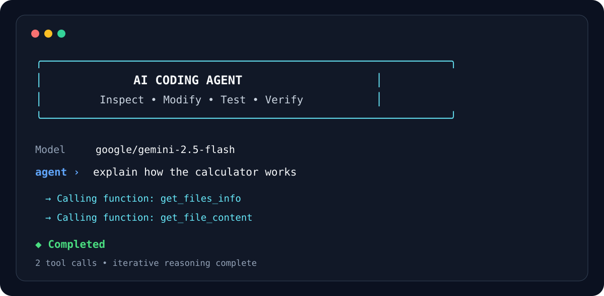
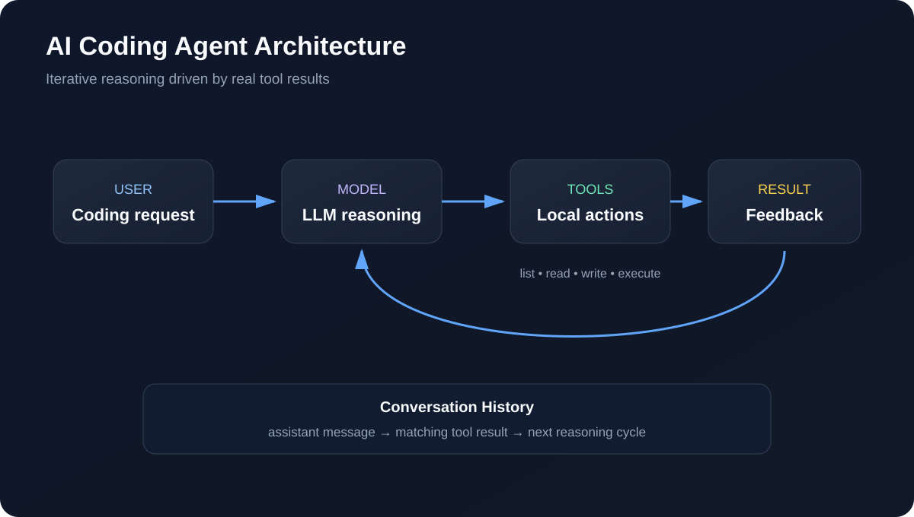

<div align="center">

# AI Coding Agent

**A lightweight autonomous coding agent that can inspect, modify, execute, and verify Python projects.**


</div>



## Overview

AI Coding Agent is a Python command-line development agent built around
an iterative **LLM → tool → result → LLM** feedback loop.

Instead of producing a single answer and stopping, the agent can inspect
a codebase, read files, execute Python programs, write changes, observe
the results, and continue working until it has enough information to
return a final response.

The original implementation was created during the Boot.dev AI Agent
curriculum and has since been extended into a cleaner standalone project.

## Key Features

| Feature | Description |
|---|---|
| Autonomous agent loop | Continues reasoning and using tools until the task is complete |
| File inspection | Lists project directories and discovers relevant source files |
| Source reading | Reads code before making changes |
| File editing | Writes fixes and new code into the working directory |
| Python execution | Runs scripts and uses their output as feedback |
| Conversation memory | Preserves assistant turns and tool results across reasoning cycles |
| Interactive shell | Supports persistent conversational coding sessions |
| CLI mode | Executes a single coding request directly from the terminal |
| Tool visibility | Displays tool calls as they happen |
| Safety limits | Caps reasoning cycles and model output tokens |
| Secret handling | Loads API credentials from `.env` rather than source code |
| Friendly errors | Provides clearer messages for authentication, credits, rate limits, and unavailable models |

## Architecture



The central loop is:

1. Receive a user request.
2. Send the conversation and tool definitions to the LLM.
3. Append the complete assistant response to conversation history.
4. Execute each requested tool.
5. Append each tool result using its matching `tool_call_id`.
6. Send the updated conversation back to the model.
7. Repeat until the model returns a final answer.

See [Architecture](docs/ARCHITECTURE.md) for more detail.

## Included Tools

The agent currently exposes tools for:

- listing files and directories
- reading file contents
- writing project files
- executing Python files

These tools give the model a controlled way to inspect and operate on a
local project.

## Installation

### 1. Clone the repository

```bash
git clone https://github.com/Alex-Unnippillil/ai-chatbot-python.git
cd ai-chatbot-python
```

### 2. Install dependencies

```bash
uv sync
```

### 3. Configure your API key

```bash
cp .env.example .env
```

Edit `.env`:

```text
OPENROUTER_API_KEY=your_key_here
```

Your actual `.env` file is excluded from Git.

## Usage

### Single request

```bash
uv run main.py "explain how the calculator renders results to the console"
```

### Interactive mode

```bash
uv run main.py
```

Example:

```text
agent › explain the calculator project
  → Calling function: get_files_info
  → Calling function: get_file_content

◆ Completed
──────────────────────────────────────────────────────────
The calculator parses the expression...
──────────────────────────────────────────────────────────
```

### Verbose mode

```bash
uv run main.py "inspect the calculator project" --verbose
```

### Select another model

```bash
uv run main.py --model "provider/model-name" "inspect the project"
```

### Adjust agent limits

```bash
uv run main.py \
  --max-iterations 10 \
  --max-tokens 2048 \
  "inspect the calculator"
```

## Interactive Commands

| Command | Purpose |
|---|---|
| `/help` | Show help and example prompts |
| `/status` | Display active model and session limits |
| `/tools` | List tools available to the agent |
| `/reset` | Clear conversation history |
| `/clear` | Clear the terminal |
| `/quit` | Exit the application |

## Example Coding Workflow

```text
User
  │
  ▼
"Fix the calculator bug"
  │
  ▼
get_files_info
  │
  ▼
get_file_content
  │
  ▼
write_file
  │
  ▼
run_python_file
  │
  ▼
Test result
  │
  ▼
Final response
```

## Project Structure

```text
.
├── main.py
├── call_function.py
├── config.py
├── prompts.py
├── functions/
│   ├── get_files_info.py
│   ├── get_file_content.py
│   ├── run_python_file.py
│   └── write_file.py
├── calculator/
├── docs/
│   ├── ARCHITECTURE.md
│   ├── FEATURES.md
│   ├── USAGE.md
│   └── assets/
├── SECURITY.md
├── CONTRIBUTING.md
└── README.md
```

## Documentation

- [Features](docs/FEATURES.md)
- [Architecture](docs/ARCHITECTURE.md)
- [Usage Guide](docs/USAGE.md)
- [Security](SECURITY.md)
- [Contributing](CONTRIBUTING.md)
- [Changelog](CHANGELOG.md)

## Security

This is an educational coding agent and should be treated accordingly.

The repository does **not** contain an API key. Credentials belong in
your local `.env` file.

Do not give an autonomous agent access to sensitive directories,
credentials, production systems, or files it does not need.

## Origins

The project began as part of the **Boot.dev AI Agent** course and was
extended with:

- persistent interactive sessions
- professional CLI presentation
- configurable models and limits
- clearer runtime errors
- richer documentation
- architecture diagrams
- safer secret handling

## License

MIT License. See [LICENSE](LICENSE).
